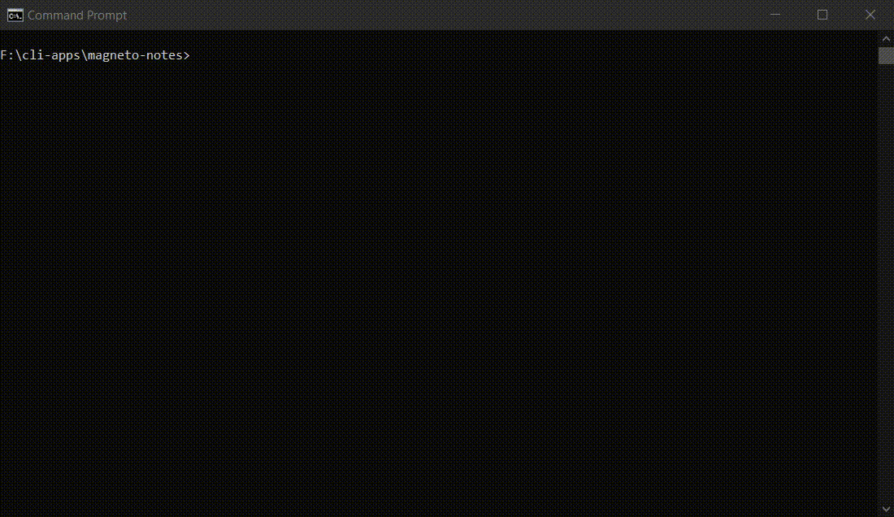

# magneto-notes


## Demo

<p align="center"></p>


## CLI

```
Usage
$ magneto-notes

Options
	--create
	--display
	--important
	--remove
	--help

Examples
  $ magneto-notes --create => opens form to create notes
  $ magneto-notes --display => display all notes
  $ magneto-notes --remove => deleting a note
  $ magneto-notes --imp ortant => display important notes
  $ magneto-notes --help => opens help window
```


